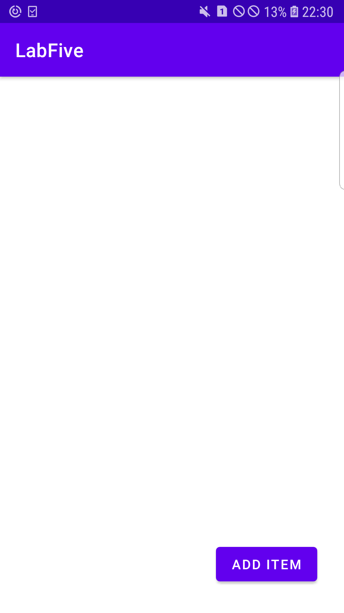
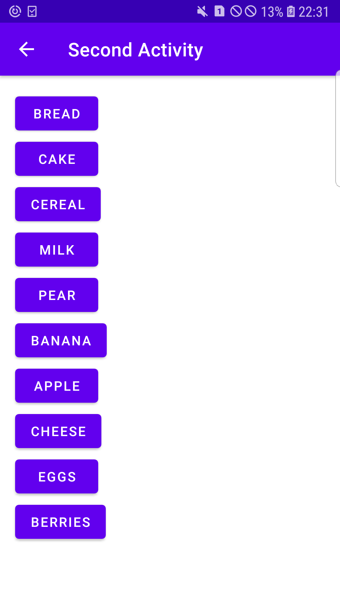

# Lab 5: Coding Challenge

**This branch consists of the Coding Challenge section for the lab work 5. The codes for every tasks along with their screenshots are attached
within this branch.**

**The task was to create two different activities that used intents to start and transfer data between them. The final app has
the feature where we can select items from a list given in the second activity and the selected items are displayed in the first
activity. The second activity consists of buttons that can be used to add the items into the shopping list.**

---

## Final App UI

### Main Activity UI

**The final app consists of two activities; mainActivity and secondActivity. The UI of the mainActivity has 10 textViews that
are visible from the start and when the products are added from the second activity, then they are displayed in the text views.
The count of a product increases when it is added multiple times.**

### Second Activity UI

**Likewise, the UI of the secondActivity has a list of 10 different items that are represented by buttons. The buttons allow the
users to add the product in the shopping list.**

---

## Adding Products in the Shopping List

**The screenshot above shows the items being added into the shopping list by clicking the buttons in the second activity.**

---

## Products Added in the Shopping List

**The screenshot above shows the products added into the shopping list.**

---
