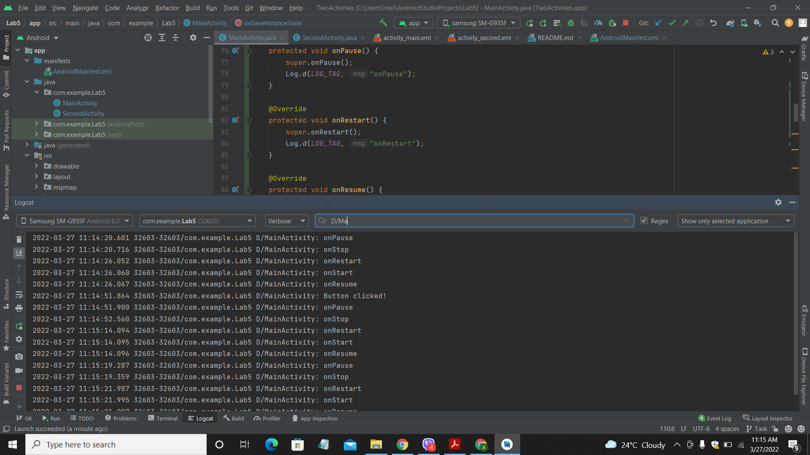

# Lab 5: Activities Lifecycle and State

**This branch consists of the task section for the lab work 5. The codes for every tasks along with their screenshots are attached
within this branch.**

**In this task, the previous lab task was used and the main thing that was done here was the use of Activity lifecycle functions.
Altogether, 6 different lifecycle functions were used and they are; onStart(), onStop(), onResume(), onPause(), onRestart() and
onDestroy().**

## Lifecycle Callbacks Being Executed

**The task was to implement the lifecycle callback functions to the two activities task of lab 4. The instructions provided in the
lab work were followed and the task was completed. The 6 lifecycle functions were used in the task and the state of the app was
examined by performing several actions like opening the app, sending messages and replies, restarting it, rotating the screen and
sometimes terminating it. The respective callback messages were displayed in the logcat pane that is shown by the screenshot below.**

