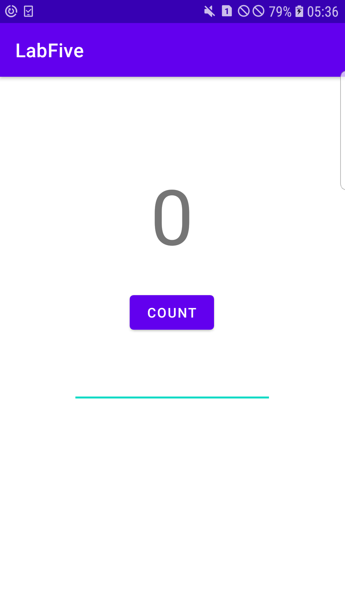
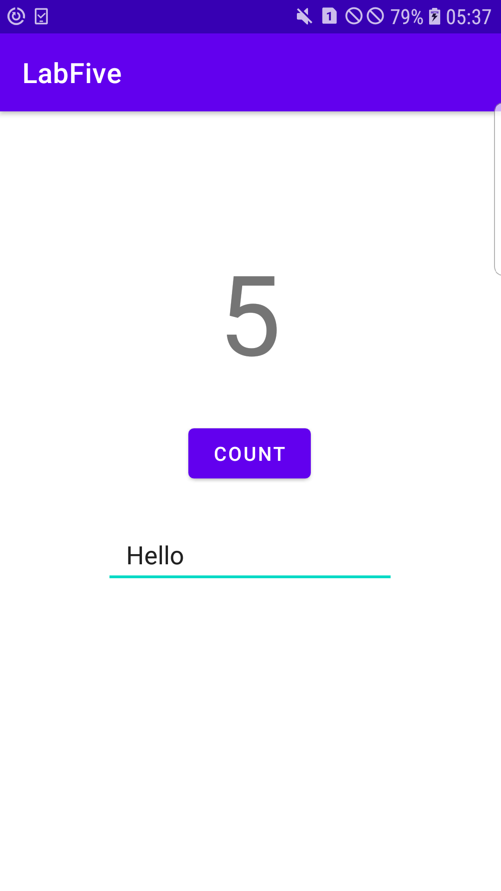
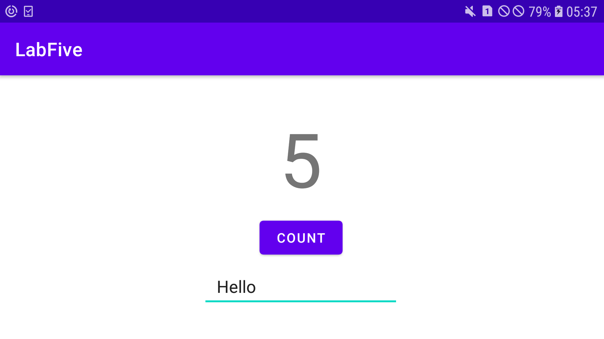

# Lab 5: Homework

**This branch consists of the 'Homework' section for the lab 5 of DMA module. There are codes and screenshots provided
within this branch and they are given below. The main task here is to save the instance of the state and the data when the 
device orientation is changed.**

---

## The Final UI

**The screenshot above shows the final UI for the Homework section of the lab 5. In the UI, there are altogether 3 different
views; 1 textView, 1 button and 1 editText. The count value is increased by the count button and the count value is displayed
in the text view. The editText view is for writing some text necessary for this task.**

---

## Filling in Values

**The screenshot above shows the activities being provided with values.**

---

## Changing the orientation

**The screenshot above shows the landscape view of the final UI for this task. The count value and the text message in the 
editText view are preserved when the device is rotated which is the requirement of this section.**

